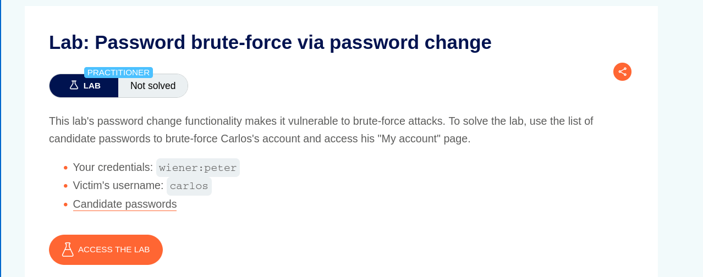
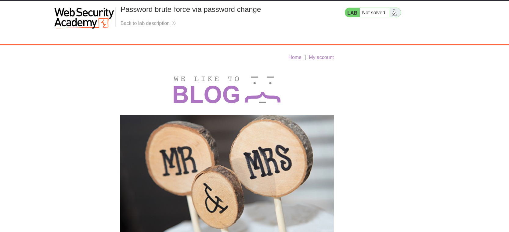
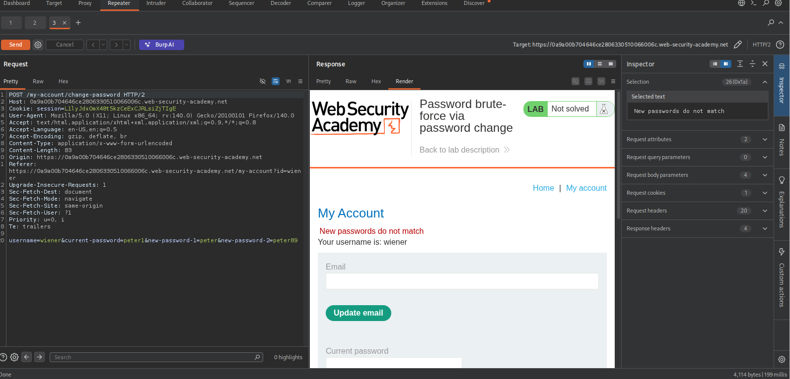
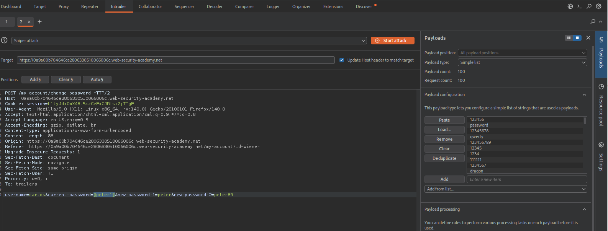
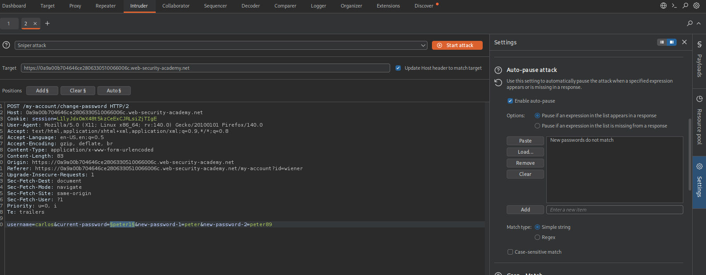
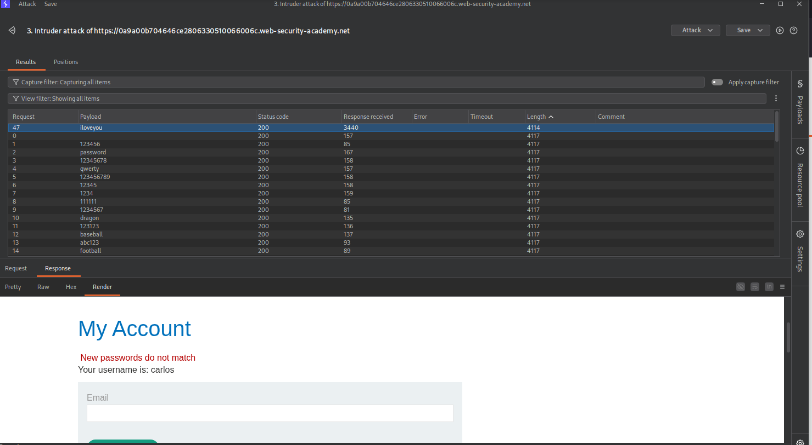
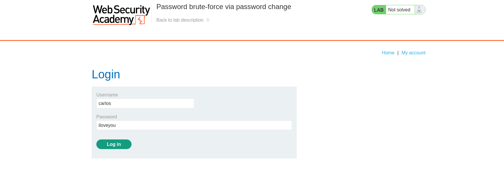
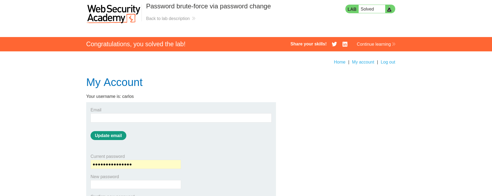

# Password Brute-Force via Password Change

This repository contains the solution for the **Password brute-force via password change** lab from PortSwigger Web Security Academy.

The lab demonstrates how a poorly implemented **password change mechanism** can be abused to perform a **password brute-force attack** against another user.

Learning Path: Server-side topics → Authentication  
Lab Difficulty: PRACTITIONER  

Lab URL:  
https://portswigger.net/web-security/authentication/other-mechanisms/lab-password-brute-force-via-password-change

---

# Lab Scenario

The application provides a password change feature after login.

Normally, changing a password requires the user to enter:

- Current password
- New password
- Confirmation of the new password

However, due to weak validation logic, the application processes the **current password field** in a way that allows attackers to test password guesses for another user.

The objective of this lab is to discover the password of the user **carlos** and log in to his account.

---

# Step 1 – Capture the Password Change Request:
username: wiener
password: peter

After logging in, navigate to the **Change Password** functionality and intercept the request using **Burp Suite**.

The request contains the following parameters:

username
current-password
new-password-1
new-password-2

This request will be used to test password guesses.

---

# Step 2 – Prepare the Intruder Attack

Send the intercepted request to **Burp Intruder**.

Replace the value of the `current-password` parameter with a payload position.

Configuration:

Attack type: Sniper

Payload: Candidate password list provided by the lab

Each request will attempt a different password guess as the **current password**.

---

# Step 3 – Detect Successful Password Guess

To identify the correct password, configure **Grep Match** in Burp Intruder.

This helps detect a response that differs from the normal failure response.

Run the Intruder attack and observe the results.

One request will produce a response that indicates the correct password.

---

# Step 4 – Login as Carlos

After discovering the correct password, go to the login page and authenticate using the credentials of the user **carlos**.

If the credentials are correct, the login will succeed.

---

# Step 5 – Lab Completed

After logging in successfully as **carlos**, the lab will be marked as solved.

---

# Security Takeaways

This lab highlights a common mistake in authentication workflows.

Important lessons include:

- Password change functionality must strictly verify user identity.
- Sensitive endpoints must be protected against brute-force attempts.
- Applications should implement proper rate limiting and monitoring.
- Authentication logic must avoid leaking information through response behavior.

Improper validation can allow attackers to **bypass authentication protections and discover user credentials**.

First, log in using the provided credentials:

