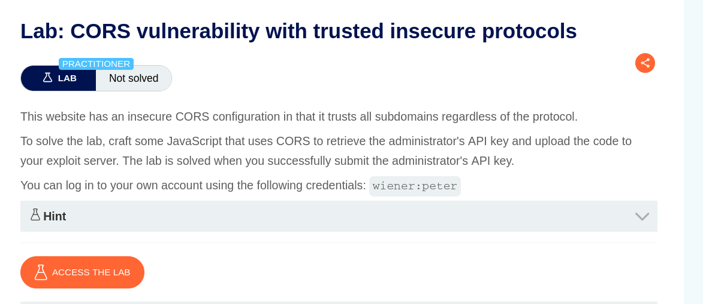
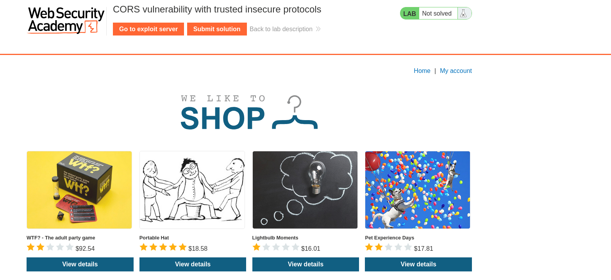
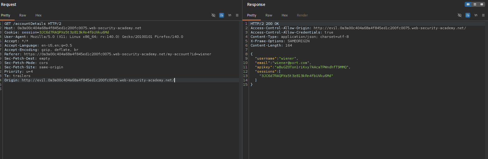
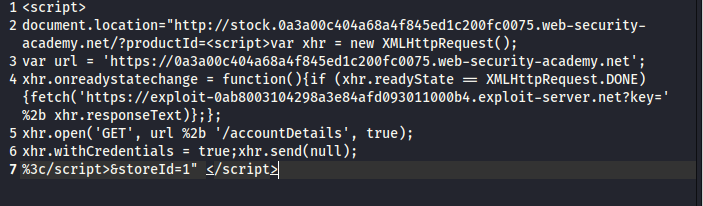
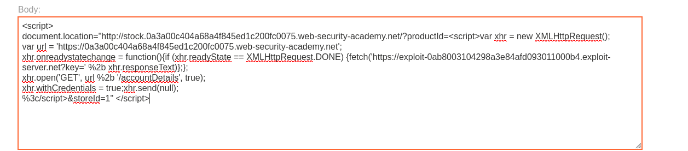
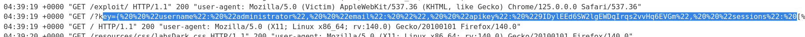
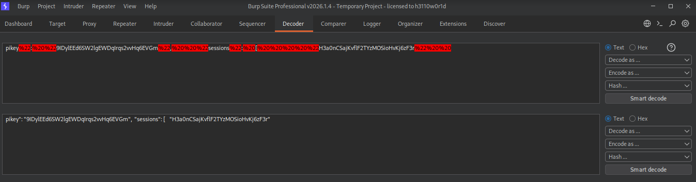
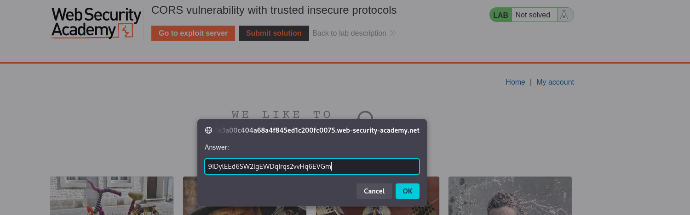
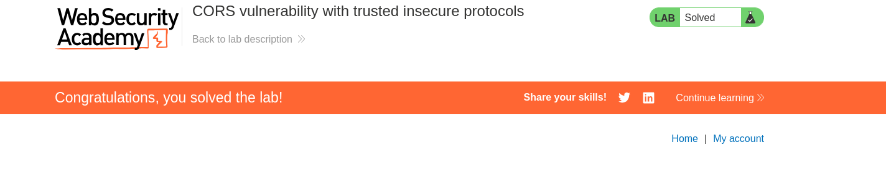

# CORS vulnerability with trusted insecure protocols

Lab Link:  
https://portswigger.net/web-security/cors/lab-breaking-https-attack

---

## Description

In this lab, the application trusts a specific origin even if it is accessed using **HTTP instead of HTTPS**.  
Because of this misconfiguration, an attacker can exploit CORS to send authenticated requests from a malicious origin and retrieve sensitive information such as the **administrator API key**.

The goal of the lab is to **steal the administrator API key and submit it to solve the lab**.

---

# Solution

## 1. Start the Lab

First, start the lab and open it in the browser.

---

## 2. Lab Environment

After launching the lab environment we begin navigating through the application.

---

## 3. Discover `/accountDetails`

While browsing the application and intercepting requests in **Burp Suite**, we find the endpoint:

/accountDetails

This endpoint returns **sensitive user information**, including the API key.

To test CORS, we modify the request and add a custom Origin header:

Origin: http://evil.YOUR-LAB-ID.web-security-academy.net

The server accepts this origin and returns the response with our sensitive data.  
This confirms that the endpoint is vulnerable to **CORS misconfiguration**.

---

## 4. Create the Exploit Script

Next, we create a JavaScript exploit that sends a request to `/accountDetails` and exfiltrates the response.

Example payload:

html
````
5. Place the Script in the Exploit Server
Paste the script inside the Exploit Server.

6. Deliver the Exploit to the Victim
Click Deliver exploit to victim so the victim loads the malicious page and executes the script.

7. Check Exploit Server Logs
After delivering the exploit, go to the logs tab in the exploit server to view captured data.

8. Capture Administrator API Key
Inside the logs, we can see the administrator account information and API key.

9. Decode the API Key
Decode the captured value to obtain the actual administrator API key.

10. Submit the API Key
Copy the extracted API key and submit it in the Submit solution field.

11. Lab Solved
After submitting the correct API key, the lab is successfully solved.

