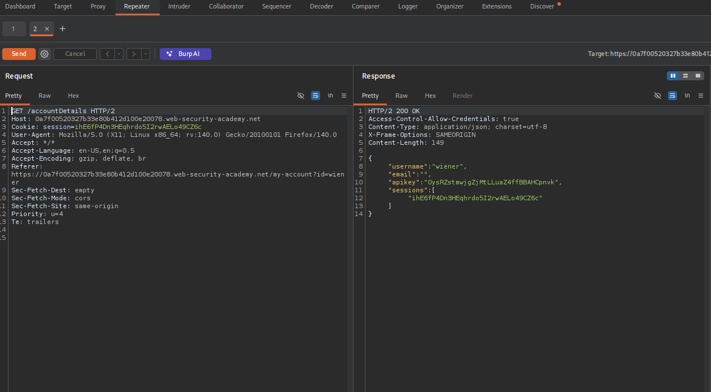
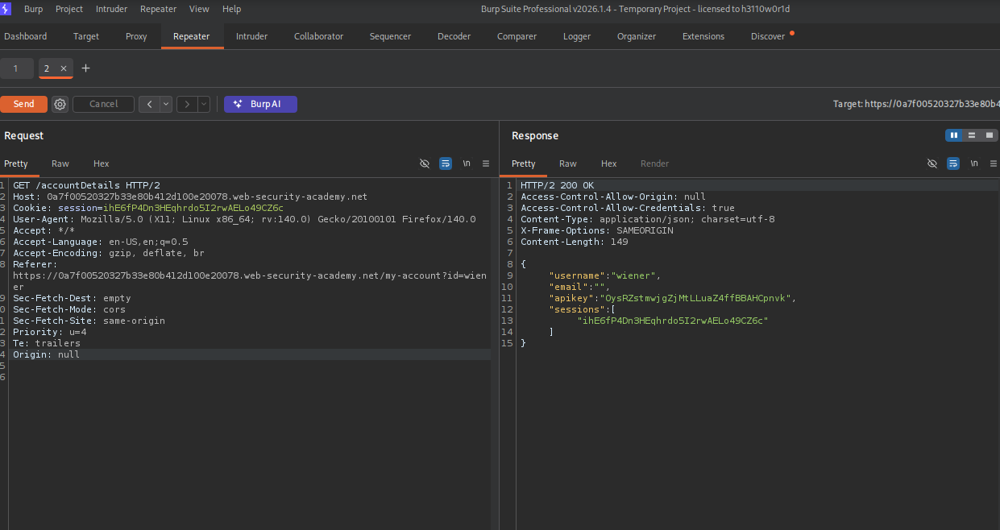
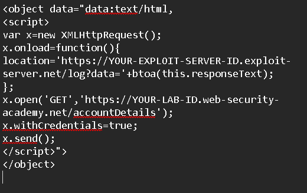
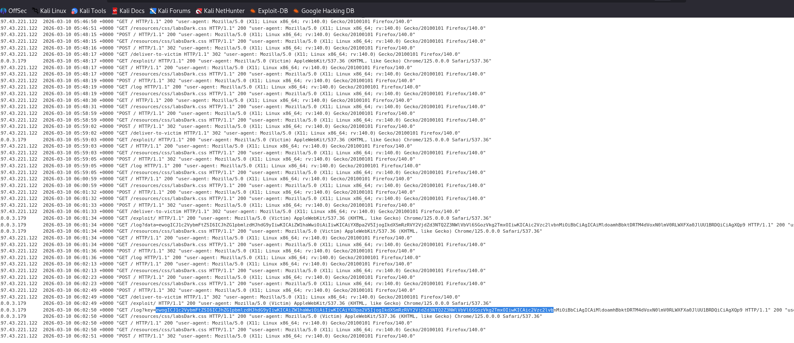
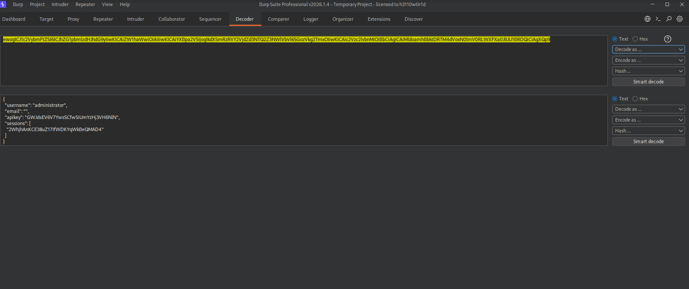
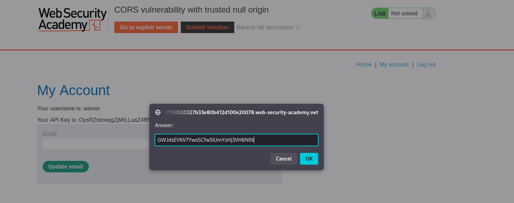
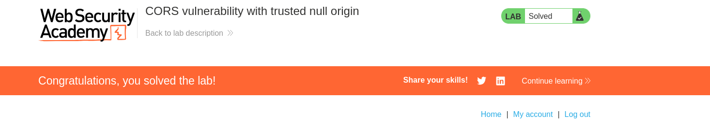

# CORS Vulnerability with Trusted Null Origin

## Lab Overview

This lab demonstrates a **Cross-Origin Resource Sharing (CORS) misconfiguration** where the server trusts the **null origin**.

Normally, web browsers restrict cross-origin requests using the **Same-Origin Policy (SOP)**. CORS allows servers to relax this policy and explicitly permit certain origins to access resources.

In this lab, the application incorrectly **whitelists the `null` origin**, which is dangerous because attackers can generate requests from environments that produce a `null` origin (such as sandboxed iframes or local files).

The goal of this lab is to exploit the trusted `null` origin to **steal the victim’s API key from their account page**.

---

## Vulnerability Explanation

CORS works using HTTP headers such as: 
Access-Control-Allow-Origin
Access-Control-Allow-Credentials

A secure implementation should:

- Only allow **trusted domains**
- Avoid using **wildcards with credentials**
- Never trust **`null` origin**

In this lab, the server:

- Allows requests from **Origin: null**
- Allows **credentials to be sent**

Because of this, an attacker can create a malicious page that:

1. Sends a cross-origin request to the victim’s account endpoint
2. Receives the sensitive response
3. Extracts the **API key**
4. Sends the key to the attacker-controlled server

---

## Steps to Solve the Lab

### 1. Start the Lab

Begin by launching the lab from PortSwigger.

---

### 2. Intercept the Account Details Request

Open the **My Account** page and intercept the request using **Burp Suite**.

---

### 3. Analyze the Server Response

Observe the response headers returned by the server.

The server includes:

Access-Control-Allow-Origin: null
Access-Control-Allow-Credentials: true

This indicates that the server **trusts the null origin**, which allows the attack.

---

### 4. Create the CORS Exploit Script

Craft a malicious JavaScript payload that:

1. Sends a request to the account endpoint
2. Extracts the API key from the response
3. Sends the key to the exploit server

---

### 5. Deliver the Exploit Using the Exploit Server

Place the exploit code inside the **Exploit Server** so that it can be delivered to the victim.

-exploit-server.png)

---

### 6. Capture the Victim’s API Key

Once the victim loads the malicious page, the script retrieves the account information and sends the API key to the exploit server logs.

---

### 7. Decode the API Key

Extract and decode the API key from the captured request.

---

### 8. Submit the Solution

Submit the stolen API key to complete the lab.

---

### 9. Lab Solved

After submitting the API key successfully, the lab is marked as solved.

---

## Impact of the Vulnerability

This vulnerability allows attackers to:

- Access **sensitive user data**
- Steal **API keys**
- Retrieve **account information**
- Perform actions on behalf of the victim

All without the victim’s knowledge.

---

## How to Prevent This Vulnerability

To secure CORS configurations:

1. Never allow **`null` origin**.
2. Only whitelist **trusted domains**.
3. Avoid using **Access-Control-Allow-Credentials with untrusted origins**.
4. Validate the **Origin header properly**.
5. Avoid reflecting arbitrary origins in the response header.

---

## Conclusion

This lab demonstrates how trusting the **null origin** in a CORS policy can expose sensitive data.

Misconfigured CORS policies can completely bypass the **Same-Origin Policy**, allowing attackers to access private user data from another origin.

