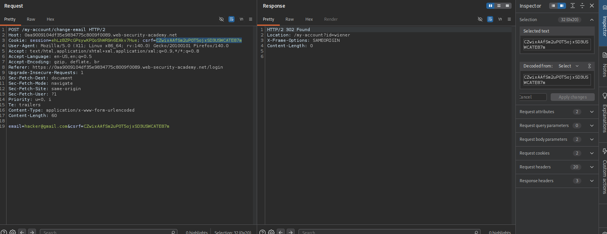
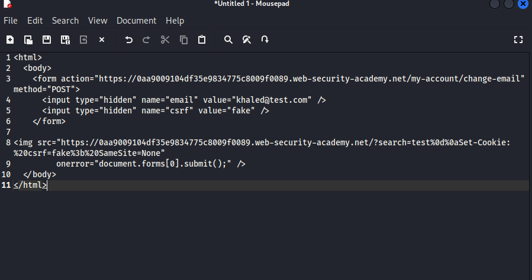
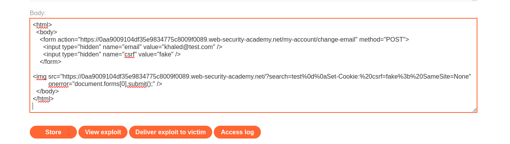

# CSRF Token Is Duplicated in Cookie

## Lab Overview

This lab demonstrates a **Cross-Site Request Forgery (CSRF)** vulnerability where the CSRF token is **duplicated in both the request parameter and a cookie**.

The application attempts to protect sensitive actions using a CSRF token. However, the token is stored in a cookie and also sent in the request body. The server simply checks whether the two values match.

Because cookies can be controlled by the browser and sometimes manipulated through certain mechanisms, this implementation creates a weakness where the CSRF protection can be bypassed.

The goal of this lab is to exploit this flawed CSRF validation and **change the victim’s email address using a forged request**.

---

## Vulnerability Explanation

A proper CSRF protection mechanism should:

- Generate a **unique token per session**
- Store it **server-side**
- Verify the token against the **user's authenticated session**

In this lab, the application incorrectly:

- Stores the CSRF token inside a **cookie**
- Sends the same token inside the **request body**
- Validates the request only by checking **if both tokens match**

Since the attacker can craft a request that sets both values to the same token, the protection becomes ineffective.

This flaw is called **CSRF Token Duplication**.

---

## Steps to Solve the Lab

### 1. Start the Lab

Launch the lab environment from PortSwigger.

---

### 2. Intercept the Email Update Request

Navigate to the **Update Email** functionality and intercept the request using **Burp Suite**.

Observe that the request contains:

- A **csrf token in the request body**
- The **same token inside a cookie**

---

### 3. Generate the CSRF Exploit

Use **Burp Suite → Engagement Tools → Generate CSRF PoC** to generate a CSRF attack script.

---

### 4. Modify the Exploit

Edit the generated exploit so it works properly by ensuring the token values match.

The script uses a crafted HTML form to submit the malicious request automatically.

%.png)

---

### 5. Deliver the Exploit Using the Exploit Server

Copy the exploit script into the **Exploit Server** and deliver it to the victim.

---

### 6. Execute the Attack

When the victim visits the malicious page, the browser automatically submits the forged request.

Since the server only checks if the tokens match, the request is accepted.

---

### 7. Lab Solved

After the forged request successfully changes the victim’s email address, the lab is marked as solved.

---

## Impact of the Vulnerability

This vulnerability allows attackers to:

- Perform unauthorized actions on behalf of victims
- Change account information such as:
  - Email address
  - Password
  - Profile settings

All without the victim's consent.

---

## How to Prevent This Vulnerability

To properly protect against CSRF:

1. **Do not store CSRF tokens in cookies**
2. Bind the token **to the user's session**
3. Validate the token **server-side**
4. Implement **SameSite cookie policies**
5. Verify **Origin and Referer headers**

---

## Conclusion

This lab demonstrates a common mistake in CSRF protection where the token is duplicated in both the request and a cookie.

Because the server only checks whether the values match, attackers can craft a malicious request that bypasses the protection and performs unauthorized actions.
