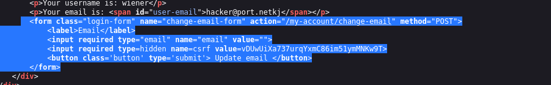
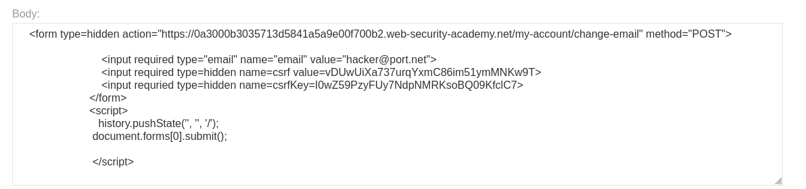
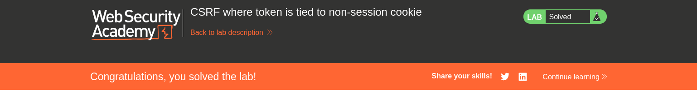

# CSRF Where Token Is Tied to Non-Session Cookie

## Lab Overview

This lab demonstrates a **Cross-Site Request Forgery (CSRF)** vulnerability where the CSRF token validation is incorrectly implemented.

Normally, CSRF tokens should be **bound to the user's session**. However, in this lab the token is tied to a **non-session cookie**, which means the application does not properly verify that the CSRF token belongs to the currently authenticated user session.

Because of this flawed implementation, an attacker can **forge a request with a valid CSRF token and force a victim to perform an unwanted action**, such as changing their email address.

The goal of the lab is to exploit this weakness and **change Carlos's email address using a CSRF attack**.

---

## Vulnerability Explanation

A secure CSRF protection mechanism should ensure:

- Each CSRF token is **unique per session**.
- The server verifies that the token belongs to the **current authenticated user session**.

In this lab:

- The CSRF token is tied to a **separate cookie instead of the session**.
- The server only checks if:
  - The token in the request matches the token stored in the cookie.
- It **does not verify if the token belongs to the authenticated session**.

This allows an attacker to **generate a valid CSRF token and trick the victim's browser into submitting it**, resulting in a successful CSRF attack.

---

## Steps to Solve the Lab

### 1. Start the Lab

Begin by launching the lab environment.

---

### 2. Login as Carlos

Login using Carlos's credentials so we can observe the request responsible for updating the email.

---

### 3. Go to Email Update Function

Navigate to the **Update Email** feature and intercept the request using Burp Suite.

---

### 4. Inspect the HTML Form

View the page source to identify the CSRF token included in the form.

The form contains a hidden input field that holds the CSRF token.

---

### 5. Generate the CSRF Exploit

Use **Burp Suite → Engagement Tools → Generate CSRF PoC** to automatically create an exploit HTML form.

The generated script will submit the forged request automatically.

---

### 6. Deliver the Exploit Using the Exploit Server

Paste the CSRF exploit script into the **Exploit Server** and deliver it to the victim.

---

### 7. Execute the Attack

Once the victim loads the malicious page, their browser sends the forged request automatically.

---

### 8. Lab Solved

After the forged request successfully changes the email address, the lab is marked as solved.

---

## Impact of the Vulnerability

This vulnerability allows attackers to:

- Perform actions **on behalf of authenticated users**
- Modify sensitive account information such as:
  - Email address
  - Password
  - Profile details

Without the user's knowledge.

---

## How to Prevent This Vulnerability

To properly protect against CSRF attacks:

1. **Bind CSRF tokens to the user session**.
2. Validate tokens **server-side for the current session only**.
3. Use **SameSite cookies**.
4. Implement **CSRF tokens with strong randomness**.
5. Validate **Origin or Referer headers** when possible.

---

## Conclusion

This lab highlights a common mistake in CSRF implementations where tokens are **not properly tied to user sessions**.

Even though a CSRF token exists, the flawed validation logic makes the protection ineffective, allowing attackers to **bypass the defense and perform CSRF attacks successfully**.
