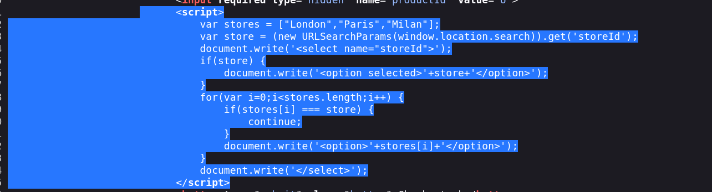
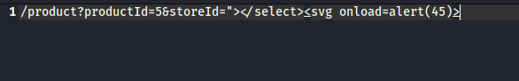

# Document.write Sink Using Source `location.search` Inside a Select Element

## Lab Link
🔗 [PortSwigger Lab](https://portswigger.net/web-security/cross-site-scripting/dom-based/lab-document-write-sink-inside-select-element)

---

## Lab Description
This lab contains a **DOM-based XSS vulnerability**.  
The page reads data from the **URL query string (`location.search`)** and writes it directly to the page using **`document.write()`** inside a `<select>` element without proper sanitization.

Because the input is not filtered, an attacker can inject malicious JavaScript that executes in the victim's browser.

---

## Step 1 – Start the Lab

We start the lab and navigate through the application.

Then we open a product page and observe the **stock selector**.

---

## Step 2 – Inspect the Page Source

Next, we check the page source using **View Page Source**.

We find a JavaScript snippet that dynamically generates the `<select>` element using `document.write()`.

The script takes the `storeId` (or stock parameter) from the URL using: location.search

and writes it directly into the DOM.

Because the input is written directly into the page without sanitization, this creates a **DOM XSS vulnerability**.

---

## Step 3 – Inject the Payload

We inject a malicious payload into the URL parameter: productId=1&storeId="><svg onload=alert(50)>

The payload breaks out of the `<option>` context and injects an SVG element with a JavaScript event.

---

## Step 4 – Trigger the XSS

When the page loads, the browser executes the injected payload.

The `onload` event fires and runs the JavaScript `alert(50)`.

---

## Payload Used

``"><svg onload=alert(50)>``
## Another Payloads 
``">
"><svg onmouseover=alert()>``

---

## Why the Vulnerability Happens

The vulnerability exists because:

- User input is taken from **`location.search`**
- It is written to the page using **`document.write()`**
- There is **no input validation or sanitization**

This allows attackers to inject arbitrary HTML or JavaScript into the DOM.

---

## Lab Solved ✅

After executing the payload successfully, the alert is triggered and the lab is marked as solved.

