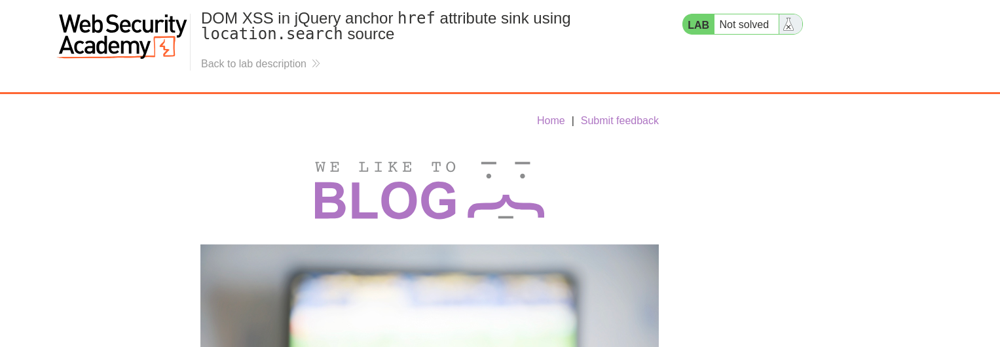
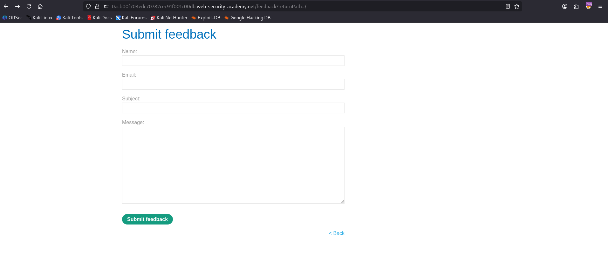
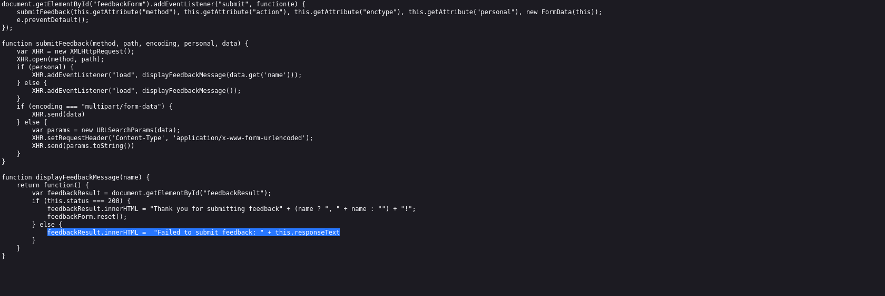
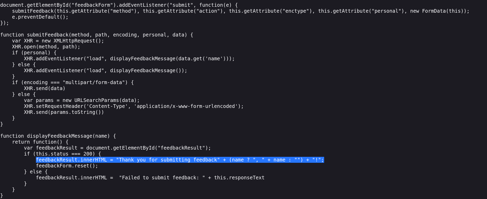
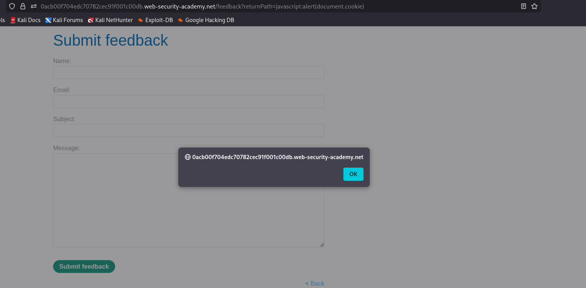

# 🎯 DOM XSS in jQuery `href` Attribute Sink (location.search → jQuery.attr)

**Write-Up by Aditya Bhatt | DOM-Based XSS | jQuery Attribute Injection | BurpSuite**

Lab Link: [https://portswigger.net/web-security/cross-site-scripting/dom-based/lab-jquery-href-attribute-sink](https://portswigger.net/web-security/cross-site-scripting/dom-based/lab-jquery-href-attribute-sink) <br/>
Lab: **DOM XSS in jQuery anchor href attribute sink using location.search source**

This PortSwigger lab contains a **DOM XSS vulnerability** inside the **Submit Feedback** page.
The JavaScript takes user input from `location.search`, feeds it into **jQuery's `$()` selector**, and dynamically updates the anchor tag’s `href` attribute — making it vulnerable to **attribute-based JavaScript execution**.


---

# 🧪 PoC (Step-by-Step with Screenshots)

## **1. Open the Lab website.**

We begin by loading the lab to examine how the feedback page uses the `returnPath` parameter.



➤ **Why?**
Understanding where the data flows from the URL helps confirm whether the sink is manipulable.

---

## **2. Go to the Submit Feedback page.**

The URL looks like:

```
?returnPath=/
```

This pattern hints that the application dynamically modifies the **Back** link based on this parameter.



➤ **Why?**
Any parameter that controls attributes like `href`, `src`, or `action` is a prime XSS candidate.

---

## **3. Enter any random string in the feedback form, submit, and inspect the Back link.**

After testing with “hii”, we find the DOM reflects it as:

```
<a id="backlink" href="/hii">Back</a>
```



➤ **Why?**
This confirms **location.search → jQuery.attr("href")**, a dangerous pattern because browsers execute JavaScript when `href` starts with `javascript:`.




## **4. Use the payload to turn `href` into executable JavaScript.**

```
javascript:alert(document.cookie)
```


➤ **Why this payload works?**

* Browsers allow URLs starting with `javascript:` inside `href` attributes.
* Clicking such a link executes the JavaScript directly.
* Since jQuery blindly injects user-controlled data into `.attr("href", ...)`, it becomes executable code.

This lets us run:

```
alert(document.cookie)
```

which proves DOM XSS.

---

## **5. Click the “Back” link — XSS triggers immediately!**



➤ **Why?**
The link no longer points to a webpage — it now **executes JavaScript** when clicked, thanks to our crafted payload.

---


# 🧠 Payload Explanation

### ✔ Payload Used

```
javascript:alert(document.cookie)
```

### 🔍 What it does

* The `javascript:` protocol turns an anchor click into script execution.
* Browsers interpret everything after it as inline JavaScript.
* With DOM sinks like jQuery `.attr()`, this is one of the simplest ways to weaponize XSS.

---

— **Aditya Bhatt** 🔥

---
